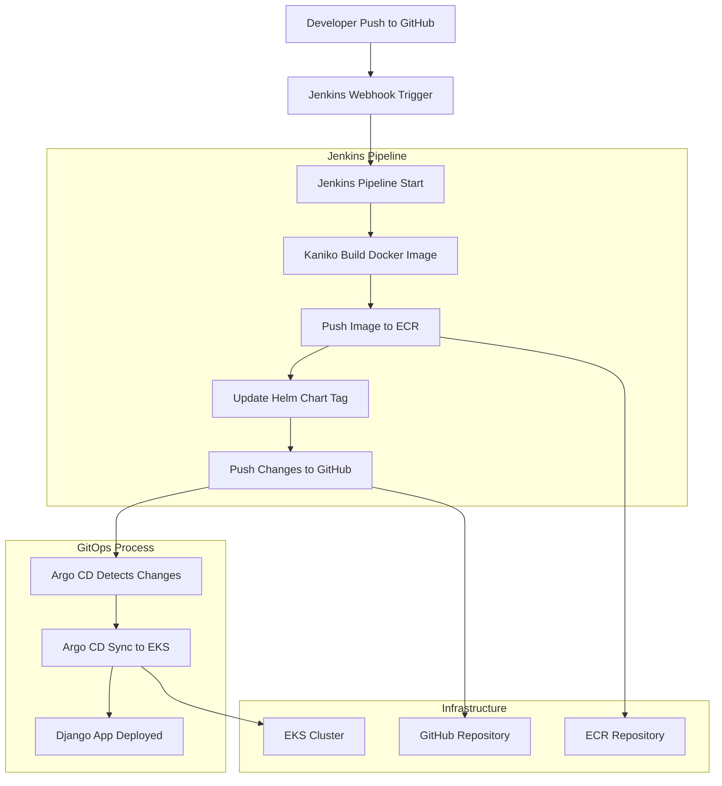

# CI/CD Process Diagram

## Повний CI/CD процес

## Компоненти системи

### Jenkins (CI)

-   **Kaniko**: Збірка Docker образів без Docker daemon
-   **Git Integration**: Автоматичне клонування репозиторію
-   **ECR Push**: Автоматичний пуш образів в Amazon ECR
-   **Helm Chart Update**: Оновлення тегів в values.yaml

### Argo CD (CD)

-   **GitOps Controller**: Відстеження змін в Git
-   **Helm Support**: Розгортання Helm charts
-   **Auto Sync**: Автоматична синхронізація з кластером
-   **Health Monitoring**: Моніторинг стану додатків

### Infrastructure

-   **EKS**: Kubernetes кластер для розгортання
-   **ECR**: Docker registry для образів
-   **S3 + DynamoDB**: Terraform state backend
-   **VPC**: Мережева інфраструктура

## Кроки виконання

1. **Code Push**: Розробник пушить код в GitHub
2. **Jenkins Trigger**: Jenkins отримує webhook або запускає job вручну
3. **Docker Build**: Kaniko збирає Docker образ з Django додатком
4. **ECR Push**: Образ пушиться в Amazon ECR з унікальним тегом
5. **Chart Update**: Jenkins оновлює тег в Helm chart values.yaml
6. **Git Push**: Зміни пушаться в GitHub репозиторій
7. **Argo CD Sync**: Argo CD виявляє зміни в Git
8. **EKS Deploy**: Argo CD розгортає оновлений Helm chart в EKS
9. **App Running**: Django додаток працює з новим образом

## Переваги архітектури

-   **Автоматизація**: Повністю автоматичний процес від коду до продакшену
-   **GitOps**: Всі зміни версіонуються в Git
-   **Безпека**: IRSA для безпечного доступу до AWS сервісів
-   **Масштабованість**: Kubernetes забезпечує горизонтальне масштабування
-   **Моніторинг**: Argo CD надає візуальний інтерфейс для моніторингу
